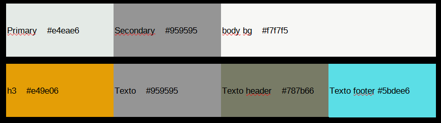

# TreeValey

## Tabla de contenidos:
---
- [Bootstrap v5.1](#Version-bootstrap-5.1)
- [Descripción y contexto](#descripción-y-contexto)
- [Guía de usuario](#guía-de-usuario)
- [Mejoras del proyecto](#Mejoras-proyecto)
- [color_font_pallete](#Color-and-font-pallete)  
- [Netlify](#Netlify)
- [Autor](#autor)

## Version bootstrap
---

## Descripción y contexto
---
Esta página es una transformación a Bootstrap de una página hecha en CSS. La web que a transformar la encontrarás en https://freewebsitetemplates.com/preview/ecoliving/index.html .

## Guía de usuario
---
**Componentes:**

<h3>Componentes de Bootstrap</h3>
- NAVBAR: Barra de navegación.
- COLLAPSE: Barra de navegación con menú desplegables.
- BUTTONS: Boton de acción para desplegar el menú.  
- BADGES: Señala las views del blog.
- CARDS: Tarjetas de información del blog.

<h3>Bootstrap Utilities</h3>
- Background
- Display
- Grid
- Flex
- Float
- Position
- Spacing
- Text

**Customización:**

<h3>Customización de colores y estilos en el custom.scss</h3>
Se han cambiado algunos colores de Bootstrap por colores propios y se han añadido algunos estilos.

## Mejoras del proyecto
---
- Se han hecho todas las páginas extras.
- La web es responsive, adaptable y fluida.

## Color and font Pallete

- La paleta de colores utilizadas es la siguiente:

## Netlify

El netlify: https://priceless-bartik-64ee6b.netlify.app/

## Autor

- Juan Ignacio Akrich Vazquez